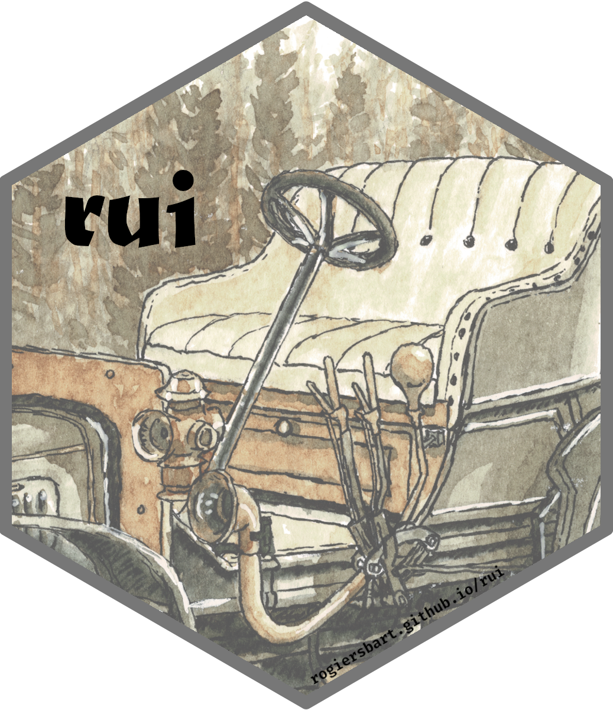

<!-- README.md is generated from README.Rmd. Please edit that file -->

```{r, include = FALSE}
knitr::opts_chunk$set(
  collapse = TRUE,
  comment = "#>",
  fig.path = "man/figures/README-",
  out.width = "100%"
)
```

# rui<br><small><font color="#333333">A simple set of UI functions</font></small>

<!-- badges: start -->
[](https://www.tidyverse.org/lifecycle/#experimental)
[](https://CRAN.R-project.org/package=rui)
<!-- badges: end -->

This package provides a wrapper around different
**[cli](https://cli.r-lib.org/)** and **[usethis](https://usethis.r-lib.org/)**
functions, aiming at providing a small but consistent set of verbs to construct
a simple R package UI.

The idea is that all of the verbs allow the use of **glue** strings and **cli**
inline styles as well, to streamline the coding with **rui**.

## Install

You can install the latest version of **rui** with any of the
following:

```{r eval = FALSE}
renv::install("rogiersbart/rui")
pak::pkg_install("rogiersbart/rui")
remotes::install_github("rogiersbart/rui")
```

## Use

The following internal functions can be called to get a quick overview. It is
best if you try this in your own console/terminal of choice, to see if styling
is supported (this should work within RStudio normally).

```{r eval = FALSE}
rui:::demo_standard_text()
rui:::demo_multi_line_feedback()
rui:::demo_single_line_feedback()
rui:::demo_user_interaction()
rui:::demo_conditions()
rui:::demo_object_inspection()
```

For a quick overview of the **glue** strings and inline **cli** styles, there
are two more internal demo functions.

```{r eval = FALSE}
rui:::demo_glue_strings()
rui:::demo_cli_inline_styles()
```

## Note

The package logo is a derivative of [Bart
Rogiers](https://rogiersbart.github.io)' [CC BY
4.0](https://creativecommons.org/licenses/by/4.0)-licensed
[espresso](https://rogiersbart.github.io/espresso) project.
